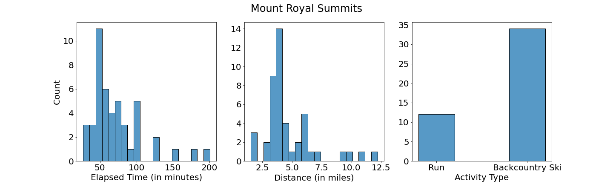

# Strava Peak Clustering And Modality Prediction

## Background & Motivation

Strava is a great asset for people wanting to track their exercise endeavors reporting more than 70 million users from more than 190 countries. Living in Colorado, where many spend their time hiking, running, skiing, and paragliding off peaks, there are lots of people who use Strava to record their adventures. While Strava provides many paid and unpaid features, there are still features that are lacking that we can use data science to answer. For example, how many times has a user reached the same "peak"? Often there are multiple paths to reach a "peak". For example, how many times has the user summitted the 1st Flatiron, a 5th class climb in Boulder, CO?  Or how many times have they climbed Mt. Victoria, towering over Frisco, CO?

## Data

I collected private [Strava](https://www.strava.com/) data from a few Colorado athletes.  For each activity, an athlete has an  overview summary including information such as activity date, type, elapsed time, distance, the associated filename, elevation gain, elevation low/high, and much more. Combining athletes there were more than 5000 recorded activities. 

<table style="width:100%">
  <tr>
    <th>Activity Date</th>
    <th>Activity ID</th>
    <th>Activity Name</th>
    <th>Activity Type</th>
    <th>Elapsed Time</th>
    <th>Distance</th>
    <th>Commute</th>
    <th>Filename</th>
    <th>Moving Time</th>
    <th>Max Speed</th>
    <th>Elevation Gain</th>
    <th>Elevation Low</th>
    <th>Elevation High</th>
    <th>Max Grade</th>
    <th>Average Grade</th>
  </tr>
  <tr>
    <td>Jul 26, 2017, 8:21:36 PM</td>
    <td>1106257168</td>
    <td>Afternoon Run</td>
    <td>Run</td>
    <td>8880</td>
    <td>16.15</td>
    <td>False</td>
    <td>activities/1210692085.fit.gz</td>
    <td>8442</td>
    <td>4.0</td>
    <td>440</td>
    <td>2139.4</td>
    <td>2549.6</td>
    <td>37.1</td>
    <td>0.0025</td>
  </tr>
</table>

For each activity, there is a file containing more detailed information about the activity often collected at second intervals throughout the activity. There were multiple different formats including: .gpx, .tcx, .fit file types to handle.  Even for a single user the method used to record each activity varied due to changing watches, using a cellphone etc. As a result, the recorded data varied in what it contained.  It was not uncommon within an activity to be missing latitude, longitude, or altitude for multiple second intervals.  Some devices used were not capable of collecting elevation data in which case for those activities all elevation data is missing. 

<table style="width:90%;margin-left:auto;margin-right=auto">
  <tr>
    <th>timestamp</th>
    <th>position_lat</th>
    <th>position_long</th>
    <th>altitude</th>
  </tr>
  <tr>
    <td>2017-07-26 20:21:46</td>
    <td>40.534288</td>
    <td>-106.784181</td>
    <td>2545.6</td>
  </tr>
    <tr>
    <td>2017-07-26 20:21:47</td>
    <td>40.534268</td>
    <td>-106.784174</td>
    <td>2546.0</td>
  </tr>
    <tr>
    <td>2017-07-26 20:21:52</td>
    <td>40.534201</td>
    <td>-106.784114</td>
    <td>2546.8</td>
  </tr>
</table>

## Clustering Peaks

Not all activities involve a peak. In order to filter activities that I believe to be a peak experience, I set the `gain_threshold` to 300 meters looking for activities where the elevation gain was greater than or equal to 300m.  Activities that met this criterion are considered in the peak clustering.

This list gives a starting point for clustering peaks.  For each activity, I picked out the latitude and longitude values that corresponded to the highest location.  This new data set, of one point per activity, that represents the peak, was used to cluster the activities into similar peaks using a distance threshold.  I used `DBSCAN`, which is part of  `scikit-learn` to do the clustering.

The `DBSCAN` algorithm has a distance threshold that has a very intuitive meaning and for this application, is the distance between peaks that should be classified together.  To visually verify that I have the correct value for this critical parameter, I mapped the peaks and color-coded different cluster to visually see how `DBSCAN` performed and then refined the value based on what I believed to be the best clustering.  Future work will investigate if this performs well across a variety of different athletes and terrain choices.

## Peak Clustering Results

I applied the algorithm described above to two different data sets.  The first is a friend who love climbing the first flatiron in Boulder, CO, but would love to know how many times he's climbed that route and some basic statistics that surround this group of data.  The second data set is from an athlete that frequently climbs Mount Victoria and runs, skis, or even paraglides off the summit. Below are two visualizations from Frisco area showing the multiple ways the same peak was ascended and descended as well as statistics about the peak activities.

Below we can see clusters near Breckenridge, Colorado. The algorithm is correctly clustering activities together that attained the same peak even if the approach or descent takes a different path. 

## Modality Prediction

There are, of course, different ways to enjoy these peaks, so the question I ask is: Can I detect changes in mode?  For example, can I detect the difference between skiing up and skiing down or running up and paragliding down. Can I identify these different segments using machine learning? 

To be able to use supervised machine learning to identify modality, I added a column indicating the mode for each row of data in more than 150+ routes.  The table below shows an example of what the data looks like with this additional column.

<table style="width:90%;margin-left:auto;margin-right=auto">
  <tr>
    <th>timestamp</th>
    <th>position_lat</th>
    <th>position_long</th>
    <th>altitude</th>
    <th>mode</th>
  </tr>
  <tr>
    <td>2020-07-09 01:31:35</td>
    <td>39.569411</td>
    <td>-106.097616</td>
    <td>2545.6</td>
    <th>run up</th>
  </tr>
    <tr>
    <td>...</td>
    <td>...</td>
    <td>...</td>
    <td>...</td>
  </tr>
    </tr>
 </tr>
    <tr>
    <td>2020-07-09 02:14:22</td>
    <td>39.559217</td>
    <td>-106.123969</td>
    <td>3124.1</td>
    <th>fly down</th>
  </tr>
</table>

 In order to use this information, and to make it possible to identify shorter or longer activities, I split the activity into 5 minute segments and created a rolling window of time series characteristics that I then used as features for learning mode.  The features I created over the window are:

1. average, std deviation, and max of distance travelled
2. average, std deviation, and max speed
3. average, std deviation, and max change in altitude
4. month of year

I then applied a random forest classifier to predict travel mode based on windowed 5 minute segments of Strava data.  Using a grid search I found an effective classifier and the remaining results in this paper refer to that model.  Below is the confusion matrix for this model:

I held out a few tracks from my training and test set to evaluate how well this method performs on unseen tracks.  The picture below shows that the model is able to identify the activity is skiing and is also able to predict the correct uphill and downhill transportation mode on an activity track with multiple ascents of the peak.

Notice in the next image that the model has a difficult time deciding if the mode is ski up or run up, but correctly identifies the fly down descent where the athlete was paragliding.

## Future Work

Similarly, although not a multisport activity, sometimes athletes drive away when they are done.  Can we detect this transition to a new mode of transportation? In order to begin to investigate this more tracks of "driveaways" need to be collected. This additional research could eventually be used as a feature in industry where your watch could prompt you to ensure that you still want to be recording or it could even auto-correct your activity.
